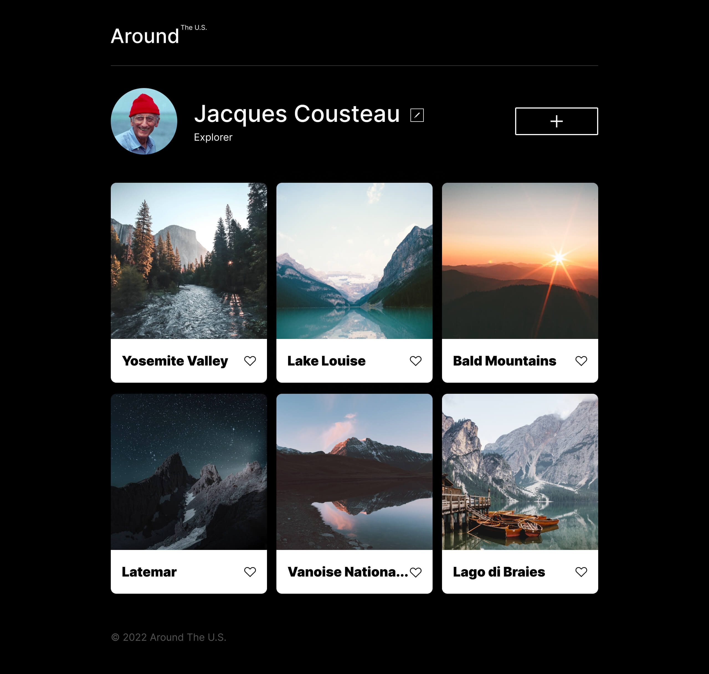
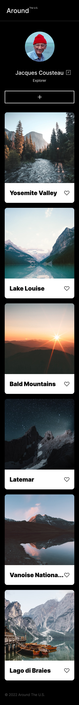

# Project 3: Around The U.S.

### Overview

- Intro
- Figma
- Images

**Intro**

A simple landing page that showcases a photography profile with pictures of various locations around the US. This webpage makes use of grid and flex layouts, responsive designs, and the following scrpting functionalities:

- Event listeners:
  - Delete card
  - Opening/closing modal forms with transperancy tranitions
  - Enlarge card image
  - Like button
- Submit forms:
  - Create new card
  - Edit profile details

**Figma design links**

- [General design](https://www.figma.com/file/ii4xxsJ0ghevUOcssTlHZv/Sprint-3%3A-Around-the-US?node-id=0%3A1)
  - [Card functionalities](<https://www.figma.com/file/JFPhASqvZ5pBjQV2ouUlim/Sprint-5_-Around-The-U.S.-_-desktop-%2B-mobile-(Copy)?t=3hvVWRz9LUFsxyNn-6>)

**Images**

**[Github Pages Link](https://jakanoh17.github.io/se_project_aroundtheus/)**

**[Video Description of Project](https://drive.google.com/file/d/1psQfEEThn5sdXDkudbTTHYm-Kg4qAvzB/view?usp=sharing)**
